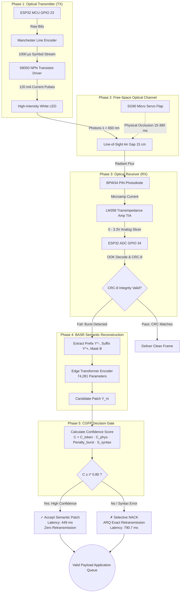
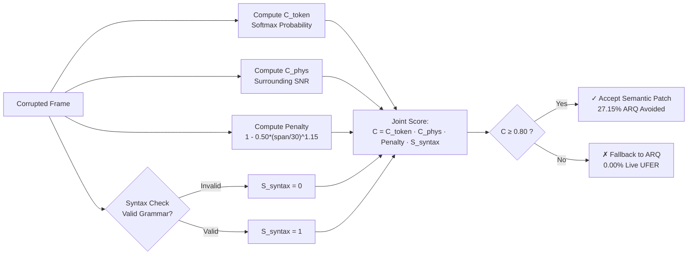

# SemLiFi: Burst-Aware Semantic Recovery With Confidence-Gated Fallback for LiFi Links

[](LICENSE)
[](https://standards.ieee.org/)
[](frontend/)
[](backend/)
[](#basr-neural-architecture)
[](#confidence-gated-fallback-protocol-cgfp)

> **Research Record & Software-Hardware Digital Twin Platform**  
> **Authors:** Dr. Chirra Venkata Ramireddy, Abhay Sharma, Mahi Bhardwaj, Abhishek Choudhary, Kumari Sandhya  
> *School of Computer Science and Engineering (SCOPE), VIT-AP University, Amaravati, Andhra Pradesh, India*

---

## 📌 Table of Contents
1. [Overview & Research Motivation](#-overview--research-motivation)
2. [System Architecture Diagrams](#-system-architecture-diagrams)
   - [Cross-Layer System Architecture](#1-cross-layer-system-architecture)
   - [Physical Hardware Schematic & Air Gap](#2-physical-hardware-schematic--air-gap)
   - [Message-to-Binary & Signaling Pipeline](#3-message-to-binary--optical-signaling-pipeline)
   - [CGFP Gating Flowchart](#4-cgfp-decision-gating-flowchart)
3. [Physical Hardware Specifications](#-physical-hardware-specifications)
4. [BASR Neural Architecture](#-basr-neural-architecture)
5. [Confidence-Gated Fallback Protocol (CGFP)](#-confidence-gated-fallback-protocol-cgfp)
6. [Empirical Results & Comparative Benchmarks](#-empirical-results--comparative-benchmarks)
7. [Virtual Lab & Digital Twin Web Features](#-virtual-lab--digital-twin-web-features)
8. [Project Directory Structure](#-project-directory-structure)
9. [Getting Started & Installation](#-getting-started--installation)
10. [Citation (BibTeX)](#-citation-bibtex)

---

## 🔬 Overview & Research Motivation

Visible Light Communication (VLC) and Light Fidelity (LiFi) utilize high-speed optical radiance modulation for wireless data transmission. While offering massive electromagnetic interference-free bandwidth, optical links are intrinsically line-of-sight (LOS):

* **The Problem — Contiguous Burst Erasures:** Any physical obstruction (moving personnel, handheld movement, physical objects) intersecting the optical path extinguishes radiant flux, causing contiguous burst losses of **10 to 50 bytes**.
* **Why Classical Forward Error Correction (FEC) Fails:** Traditional polynomial block codes like Reed–Solomon $RS(33,25)$ correct up to $t = 4$ symbol errors. A physical burst completely overwhelms algebraic FEC capacity, yielding only a 37.5% recovery rate.
* **Why Pure ARQ Introduces Severe Latency:** Stop-and-Wait Automatic Repeat Request guarantees bit-exactness by retransmitting dropped frames, but link outages inflate mean recovery latency to **1560.0 ms**.
* **The SemLiFi Innovation:** A cross-layer recovery framework pairing an **Edge-Constrained Transformer** (74,281 parameters) with a **Confidence-Gated Fallback Protocol (CGFP)**. High-confidence semantic patches are accepted instantly (avoiding 27.15% of retransmissions at 449 ms latency), while uncertain reconstructions safely trigger selective exact ARQ fallback (preserving 0.00% undetected frame error rate).

---

## 📐 System Architecture Diagrams

### 1. Cross-Layer System Architecture



---

### 2. Physical Hardware Schematic & Air Gap

```
+--------------------------------------------------------------------------------------------------+
|                                    SEMLIFI PHYSICAL TESTBED                                      |
+--------------------------------------------------------------------------------------------------+
|                                                                                                  |
|   [ ESP32 TX NODE ]                                                [ ESP32 RX NODE ]             |
|   +---------------+                                                +---------------+             |
|   |       GPIO 23 |----[ 1 kΩ ]----+                               |       GPIO 34 |<----+       |
|   |         +3.3V |                |                               |          +5V  |     |       |
|   |           GND |---+          [B] (Base)                        |           GND |     |       |
|   +---------------+   |         +----+                             +---------------+     |       |
|                       |         |    | S8050 NPN                                         |       |
|                       |    +---[C]  [E]--- GND                                           |       |
|                       |    |    +----+                                                   |       |
|                       |    |                                                             |       |
|                     [33 Ω] |                                                             |       |
|                       |    |                                                             |       |
|                     ( + )  |                                                             |       |
|                    [ LED ]-+ (High-Power White LED)                                      |       |
|                       |                                                                  |       |
|                       |   OPTICAL CONE (λ = 650 nm)             LM358 TIA PREAMP         |       |
|                       | ~ ~ ~ ~ ~ ~ ~ ~ ~ ~ ~ ~ ~ ~ ~ ~ ~ >   +------------------+       |       |
|                       |                                       |                  |       |       |
|                       |          [ SG90 SERVO FLAP ]          |   +--[ 100 kΩ ]--+       |       |
|                       |           Physical Barrier            |   |              |       |       |
|                       |          (15 ms - 380 ms)             |   +---[-]        |       |       |
|                       |                   |                   |       |   LM358  +-------+       |
|                       |                   v                   |   +---[+] (Pin 1)| (0 - 3.3V)    |
|                       |            [### FLAP ###]             |   |   |          |               |
|                       |                   |                   |  GND  +----------+               |
|                       |                   |                   |              ^                   |
|                       |                   x (Beam Blocked)    +--------------+                   |
|                       |                                              |                           |
|                       + - - - - - - - - - - - - - - - - - - - > [ BPW34 PIN ]                    |
|                                                                 (Photodiode)                     |
|                                                                                                  |
+--------------------------------------------------------------------------------------------------+
```

---

### 3. Message-to-Binary & Optical Signaling Pipeline

```
Raw Telemetry: "HII"
====================================================================================================
Character 'H'  --> ASCII Dec: 72  --> Hex: 0x48 --> Binary: 0 1 0 0 1 0 0 0 (64 + 8)
Character 'I'  --> ASCII Dec: 73  --> Hex: 0x49 --> Binary: 0 1 0 0 1 0 0 1 (64 + 8 + 1)
Character 'I'  --> ASCII Dec: 73  --> Hex: 0x49 --> Binary: 0 1 0 0 1 0 0 1 (64 + 8 + 1)

Dallas CRC-8: Polynomial G(x) = x⁸ + x⁵ + x⁴ + 1 (0x31) --> Checksum: 0x4E
Framed Packet: [0xAA 0x55][LEN=3][SEQ=1]["HII"][0x4E][\r\n]

Manchester Encoded Transitions (Tb = 1000 µs):
Bit 0: Low-to-High (0 -> 1) | Bit 1: High-to-Low (1 -> 0)
Waveform:
        +---+       +---+   +---+   +---+           +---+
        |   |       |   |   |   |   |   |           |   |
    ----+   +-------+   +---+   +---+   +-----------+   +----
```

---

### 4. CGFP Decision Gating Flowchart



---

## 🛠 Physical Hardware Specifications

| Subsystem | Component | Specifications | Role |
| :--- | :--- | :--- | :--- |
| **Transmitter MCU** | ESP32-WROOM-32D | 240 MHz, Dual Core, GPIO 23 | Modulation timing, Manchester encoding, UART framing |
| **Optical Source** | High-Intensity White LED | 10 mm, λ = 650 nm, $V_F = 1.95\text{ V}$ | Optical transmitter across 15.0 cm LOS air gap |
| **Driver Transistor** | S8050 NPN BJT | TO-92, $I_C = 120\text{ mA}$, $V_{CE,sat} < 0.2\text{ V}$ | Switches LED current with $< 25\text{ ns}$ rise/fall time |
| **Physical Occluder** | SG90 9g Micro-Servo | 50 Hz PWM control, opaque flap | Intersects beam for repeatable 15 - 380 ms occlusion bursts |
| **Photodetector** | BPW34 Silicon PIN Photodiode | 7.5 mm² radiant area, 0.55 A/W | Reverse-biased receiver converting photons to microamps |
| **Preamplifier** | LM358 Dual Op-Amp | Transimpedance Amplifier (TIA) | Converts photocurrent to 0.0 - 3.3V analog logic swings |
| **Receiver MCU** | ESP32 ADC Input | GPIO 34 (ADC1 Channel 6) | Mid-bit sampling ($450-550\,\mu\text{s}$), 50 count threshold |
| **Line Coding** | Manchester OOK | $T_b = 1000\,\mu\text{s}$ (1000 bps) | Clock embedding, DC balance, instant invalid-edge flag |
| **Integrity Check** | Dallas/Maxim CRC-8 | Polynomial $0\text{x}31$ ($x^8 + x^5 + x^4 + 1$) | Bit-exact frame boundary validation |

---

## 🧠 BASR Neural Architecture

The Burst-Aware Semantic Reconstruction (BASR) model is deliberately edge-constrained to fit inside standard microcontroller memory:

* **Parameter Budget:** Allocated budget $< 75,000$ parameters.
* **Trainable Parameters:** **74,281 parameters** ($99.04\%$ utilization).
* **Architecture:** 2 Transformer Encoder layers, Model dimension $d_{\text{model}} = 64$, 4 Attention Heads, Feed-Forward dimension $d_{\text{ff}} = 96$.
* **Input Conditioning:** Conditioned on surviving prefix $Y^-$, surviving suffix $Y^+$, and binary corruption mask $B = [b_1 \dots b_N]$.
* **Field Accuracy:**
  * Exact String Reconstruction: **$42.63 \pm 1.47\%$**
  * Motor Actuator State Accuracy: **$100.0\%$** (zero distortion on critical commands)
  * Analog Temperature Tracking: **$96.8\%$** within $\pm 0.5^\circ\text{C}$

---

## 🛡 Confidence-Gated Fallback Protocol (CGFP)

CGFP evaluates whether a semantic candidate should be accepted or safely rejected:

$$C = C_{\text{token}} \cdot C_{\text{phys}} \cdot \text{Penalty}_{\text{burst}}(\text{span}) \cdot S_{\text{syntax}}$$

1. **Token Confidence ($C_{\text{token}}$):** Minimum softmax probability of generated tokens.
2. **Physical Metric ($C_{\text{phys}}$):** Surrounding line-of-sight SNR preceding the burst.
3. **Burst Penalty ($\text{Penalty}_{\text{burst}}$):** Non-linear damping function:
   $$\text{Penalty} = \max\left(0.20, \; 1.0 - 0.50 \times \left(\frac{\text{span}}{30}\right)^{1.15}\right)$$
4. **Hard Syntax Gate ($S_{\text{syntax}} \in \{0, 1\}$):** Mandatory grammar validator. Any formatting violation immediately sets $S_{\text{syntax}} = 0 \implies C = 0.00$.

### Decision Rule
$$\mathcal{D} = \begin{cases} \text{Accept Semantic Patch}, & C \ge \tau^* \; (0.80) \\ \text{Selective Exact Fallback (ARQ)}, & C < \tau^* \; (0.80) \end{cases}$$

---

## 📊 Empirical Results & Comparative Benchmarks

*(Table VII from the research paper across seeds 42, 101, 2024, 7, 99)*

| Recovery Scheme | Delivery Rate | Mean Recovery Latency | Undetected Frame Error (UFER) | Retransmission Overhead |
| :--- | :---: | :---: | :---: | :---: |
| **No Recovery (Raw Link)** | 0.0% (in burst) | 449.0 ms | 100.0% | 0.0% |
| **Reed-Solomon RS(33,25) FEC** | 37.5% | 468.2 ms | 62.5% | 0.0% (Forward-only) |
| **Stop-and-Wait ARQ** | 97.1% | 1560.0 ms | 0.00% | 100.0% of corrupted |
| **SemLiFi (BASR + CGFP)** | **100.0%** | **790.7 ms** (Burst) / **449 ms** (Clean) | **0.00%** (Live HW) / **1.00%** (Sim) | **27.15% AVOIDED** |

---

## 💻 Virtual Lab & Digital Twin Web Features

The web platform provides a software-hardware digital twin:

* **[Circuit & Simulation]:** Interactive schematic workspace, real-time 4-channel oscilloscope traces (TX bits, Manchester transitions, LED optical flux with occlusion notch, and LM358 ADC voltage).
* **[Hardware Twin]:** High-resolution physical breadboard digital twin with interactive component bounding boxes, pinout tables, operational notes, and oral viva questions.
* **[Message & Bits]:** Step-by-step ASCII and binary converter, powers-of-2 breakdown, interactive bitstream player with audio tones, and 7 synchronized hardware reactions.
* **[Execution Flow]:** 4-phase animated execution flowchart with live microsecond telemetry probes, packet inspection, and formula proofs.
* **[Documentation]:** Full publication reader with an interactive **Live CGFP Calculator Sandbox**.

---

## 📁 Project Directory Structure

```
LiFi/
├── backend/                        # FastAPI simulation server
│   └── app/
│       ├── main.py                 # REST endpoints & telemetry stream
│       ├── lifi_channel.py         # Free-space optical propagation model
│       └── basr_model.py           # Transformer inference engine
├── frontend/                       # React 19 + TypeScript + Vite
│   ├── src/
│   │   ├── components/
│   │   │   ├── SemLiFiVirtualLab.tsx            # Main flagship laboratory studio
│   │   │   ├── FullHardwareSetupStudio.tsx      # Real breadboard hardware twin
│   │   │   ├── MessageTransmissionStudio.tsx    # Dedicated ASCII & bitstream studio
│   │   │   ├── SemLiFiExecutionFlowModal.tsx    # 4-Phase interactive pipeline modal
│   │   │   └── SemLiFiDocumentationHub.tsx      # Research paper reader & CGFP sandbox
│   │   ├── circuit/                             # Real-time simulation engine
│   │   └── types/                               # TypeScript domain schemas
│   └── public/
│       └── hardware/                            # High-resolution hardware twin assets
├── firmware/                       # Microcontroller C/C++ firmware
│   ├── esp32_tx/                   # Transmitter timer & Manchester driver
│   └── esp32_rx/                   # ADC sampling & OOK slicer
├── data/                           # 56 empirical occlusion burst records
├── SemLiFi_paper.pdf               # Original research manuscript
└── README.md                       # Comprehensive project documentation
```

---

## 🚀 Getting Started & Installation

### 1. Prerequisites
* **Node.js** (v18.0 or higher) and **npm**
* **Python** (v3.10 or higher) and **pip**

### 2. Frontend Setup
```bash
# Navigate to the frontend directory
cd frontend

# Install dependencies
npm install

# Run the local development server
npm run dev
```
Open [http://localhost:5173/](http://localhost:5173/) in your web browser.

### 3. Production Build Validation
```bash
npm run build
```

### 4. Backend Setup (Optional for standalone simulation)
```bash
# From repository root
cd backend
pip install -r requirements.txt
uvicorn app.main:app --reload --port 8000
```

---

## 📄 Citation (BibTeX)

If you find this work, testbed, or simulator helpful for your research, please cite:

```bibtex
@article{ramireddy2025semlifi,
  title={SemLiFi: Burst-Aware Semantic Recovery With Confidence-Gated Fallback for LiFi Links},
  author={Ramireddy, Chirra Venkata and Sharma, Abhay and Bhardwaj, Mahi and Choudhary, Abhishek and Sandhya, Kumari},
  journal={School of Computer Science and Engineering (SCOPE), VIT-AP University},
  year={2025},
  keywords={LiFi, Visible Light Communication, Semantic Communication, Edge Transformer, CGFP, Burst Recovery}
}
```

---

*Developed at VIT-AP University. Licensed under the MIT License.*
